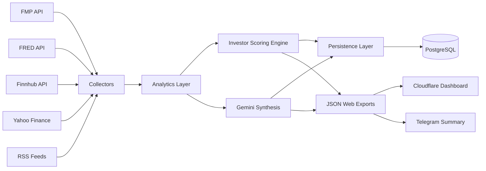
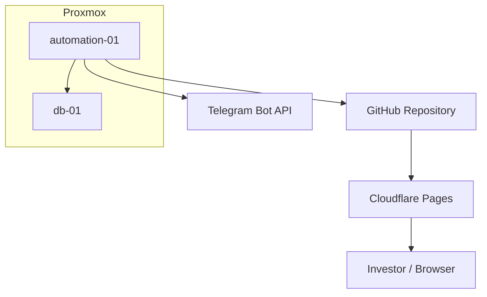
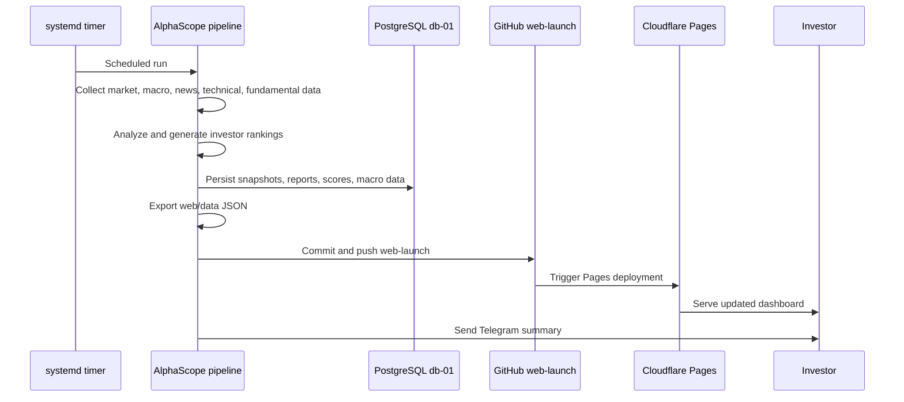
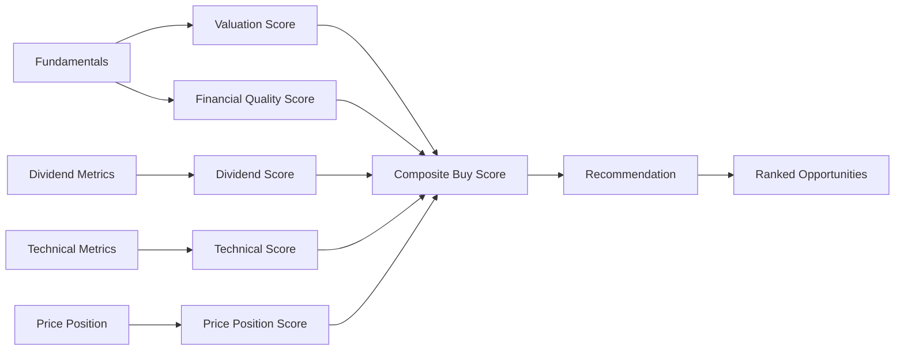
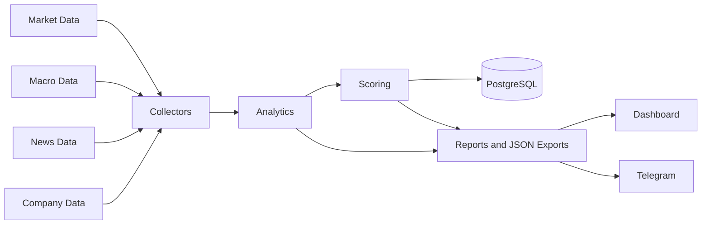

# AlphaScope Investor Edition

AlphaScope is an AI-assisted market intelligence and investor research platform
that turns market, macroeconomic, technical, and fundamental data into ranked
investment opportunities.

## Executive Summary

AlphaScope exists to solve a practical investor workflow problem: market data is
abundant, fragmented, and difficult to convert into repeatable decisions. The
platform collects market and company data, applies deterministic analytics,
persists results to PostgreSQL, generates investor rankings, publishes a static
dashboard, and sends Telegram summaries after each production run.

The intended audience is long-term investors, technical reviewers, future
contributors, and hiring teams evaluating applied software engineering,
automation, infrastructure, and AI-assisted analysis work.

AlphaScope is not a trading bot and does not provide financial advice. It is a
decision-support system built around transparent scoring, durable persistence,
and repeatable operations.

## Current Status

**AlphaScope Investor Edition V1: Operational Production Release**

Production validation completed:

- Market, macro, technical, fundamental, and news collection operational.
- Investor ranking engine operational.
- PostgreSQL persistence operational.
- Static web dashboard artifacts generated successfully.
- Telegram summaries delivered successfully.
- systemd timer runs unattended.
- GitHub deploy-key issue remediated.
- Automated push to `origin/web-launch` validated.
- Cloudflare Pages deployment validated.
- Production site update path verified.
- Browser cache issue identified and resolved.

## Core Capabilities

- **Market intelligence**: collects broad market, sector, volatility, commodity,
  crypto, and earnings context.
- **Investor ranking engine**: ranks symbols by composite buy score and
  recommendation category.
- **Technical analysis**: evaluates RSI, moving averages, volatility, relative
  strength, drawdown, and price position.
- **Fundamental analysis**: collects and persists revenue, income, free cash
  flow, valuation, balance sheet, ROE, debt, and dividend metrics.
- **Macro intelligence**: integrates FRED macro observations and macro regime
  snapshots.
- **AI-assisted synthesis**: uses Gemini for market and event interpretation
  after deterministic data collection.
- **PostgreSQL persistence**: stores intelligence reports, technical snapshots,
  fundamental snapshots, macro data, investor scores, and related history.
- **Telegram delivery**: sends concise investor summaries after successful runs.
- **Cloudflare-hosted dashboard**: publishes static dashboard assets through a
  Git-driven Cloudflare Pages workflow.
- **Unattended automation**: runs on an automation host via systemd timer.

## Technology Stack

| Area | Technology |
|---|---|
| Language | Python |
| Database | PostgreSQL |
| Dashboard hosting | Cloudflare Pages |
| Source control and deployment trigger | GitHub |
| Scheduler | systemd timer/service |
| Virtualization / lab infrastructure | Proxmox |
| Fundamentals and quotes | Financial Modeling Prep |
| Macro data | FRED |
| News | Finnhub, RSS financial feeds |
| Market and technical context | Yahoo Finance |
| AI synthesis | Google Gemini |
| Notifications | Telegram Bot API |

## Architecture Overview



## Infrastructure Overview



## Deployment Overview

AlphaScope uses a Git-driven static deployment model. The systemd timer runs
the production refresh on `automation-01`, validates generated dashboard JSON,
commits changed web data to `web-launch`, and pushes to GitHub. Cloudflare Pages
deploys the static dashboard from the `web` directory on that branch.



## Investor Scoring Engine



The current score weights are:

- Valuation: 25%
- Financial quality: 30%
- Dividend: 15%
- Price position: 15%
- Technical: 15%

## Data Lifecycle



## Repository Structure

```text
alphascope/
|-- app/
|   |-- ai/              # Gemini and AI synthesis clients
|   |-- analytics/       # scoring, ranking, macro, and technical engines
|   |-- collectors/      # FMP, FRED, Finnhub, RSS, Yahoo-backed collectors
|   |-- config/          # symbol and watchlist configuration
|   |-- db/              # database models, migrations, persistence helpers
|   |-- processors/      # signal, event, confidence, and news processing
|   |-- renderers/       # reports, Telegram, and static web exports
|   `-- main.py          # pipeline entry point
|-- config/              # watchlist configuration
|-- deploy/systemd/      # service and timer units
|-- docs/                # architecture, operations, decisions, status
|-- reports/             # generated report artifacts
|-- scripts/             # production refresh wrapper
|-- web/                 # static dashboard and generated JSON data
`-- requirements.txt
```

## Documentation

- [Architecture](docs/ARCHITECTURE.md)
- [Operations Runbook](docs/OPERATIONS.md)
- [Architecture Decisions](docs/DECISIONS.md)
- [Project Status](docs/PROJECT_STATUS.md)
- [Release Notes V1](docs/RELEASE_NOTES_V1.md)
- [API Usage Audit](docs/API_USAGE_AUDIT.md)
- [Documentation Archive](docs/archive/)

## Screenshots

Screenshots are intentionally represented as placeholders until production
captures are added to the repository.

| Screen | Placeholder |
|---|---|
| Investor dashboard | `docs/screenshots/investor-dashboard.png` |
| Opportunity detail | `docs/screenshots/opportunity-detail.png` |
| Cloudflare deployment | `docs/screenshots/cloudflare-deployment.png` |
| Telegram summary | `docs/screenshots/telegram-summary.png` |

## Setup

```bash
git clone https://github.com/dunga101/alphascope.git
cd alphascope
python3 -m venv .venv
source .venv/bin/activate
pip install -r requirements.txt
```

Create `.env`:

```env
GEMINI_API_KEY=
FMP_API_KEY=
FRED_API_KEY=
FINNHUB_API_KEY=

DB_HOST=
DB_NAME=alphascope
DB_USER=
DB_PASSWORD=
DB_PORT=5432

TELEGRAM_BOT_TOKEN=
TELEGRAM_CHAT_ID=
```

Run locally:

```bash
python -m app.main full
```

## Production Automation

Production refresh is driven by:

```text
deploy/systemd/alphascope.timer
  -> deploy/systemd/alphascope.service
  -> scripts/alphascope_refresh.sh
  -> python -m app.main full
  -> web/data/*.json validation
  -> git push origin web-launch
  -> Cloudflare Pages deployment
```

Timer schedule:

```text
09:00 UTC
13:00 UTC
17:00 UTC
```

See [Operations Runbook](docs/OPERATIONS.md) for validation and recovery
commands.

## Roadmap

Future ideas, not part of V1:

- Historical buy-score trend charts.
- Portfolio tracking and allocation analytics.
- User-specific watchlists.
- Opportunity alerts and alert history.
- Prediction accuracy tracking.
- Confidence calibration engine.
- Expanded universe screening.
- API usage and quota observability.
- Dashboard screenshots and deployment evidence gallery.
- Authenticated family investment portal.

## Disclaimer

AlphaScope is an educational and engineering project. It is not financial,
investment, tax, or legal advice. Users remain solely responsible for all
investment decisions.
