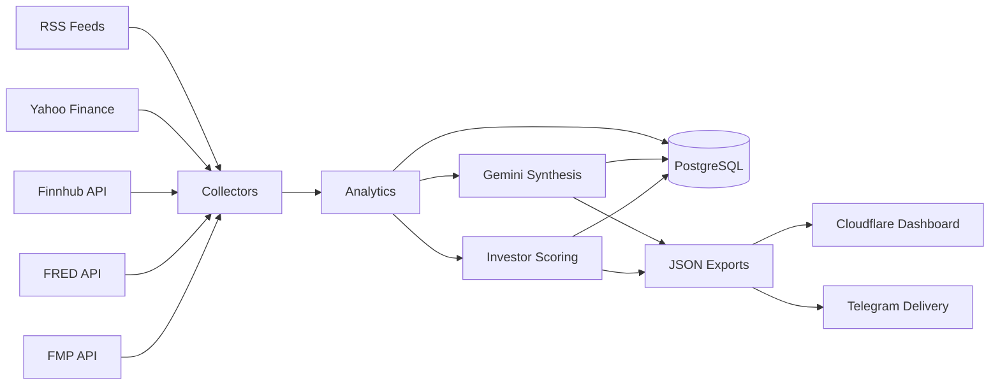
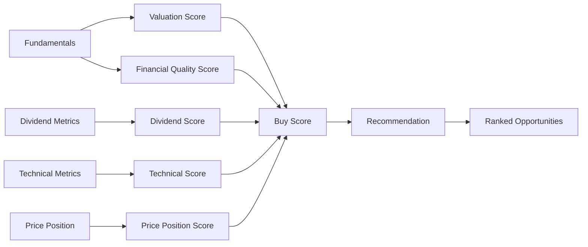
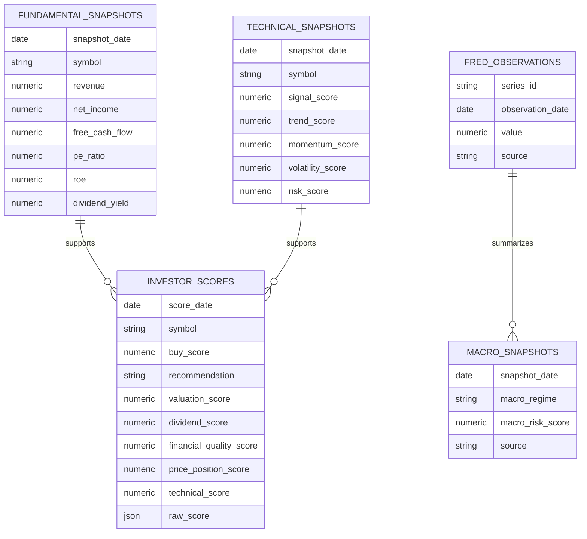
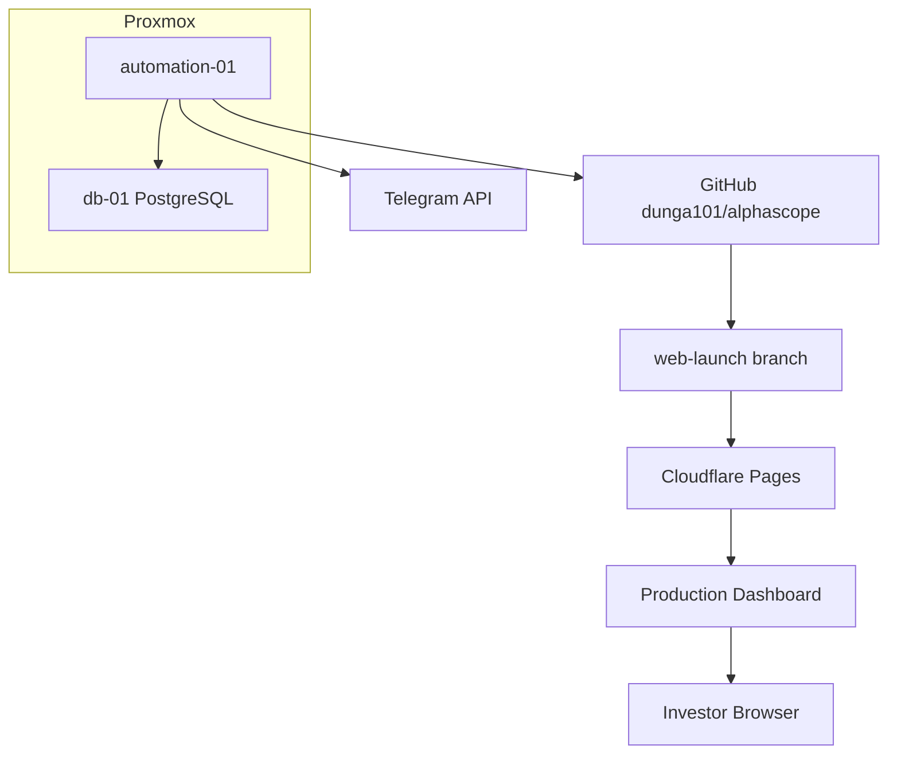
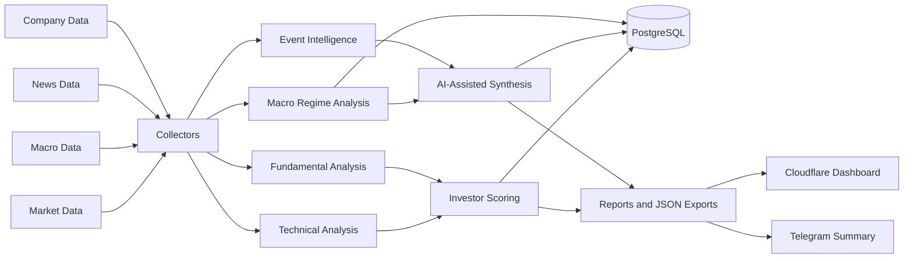
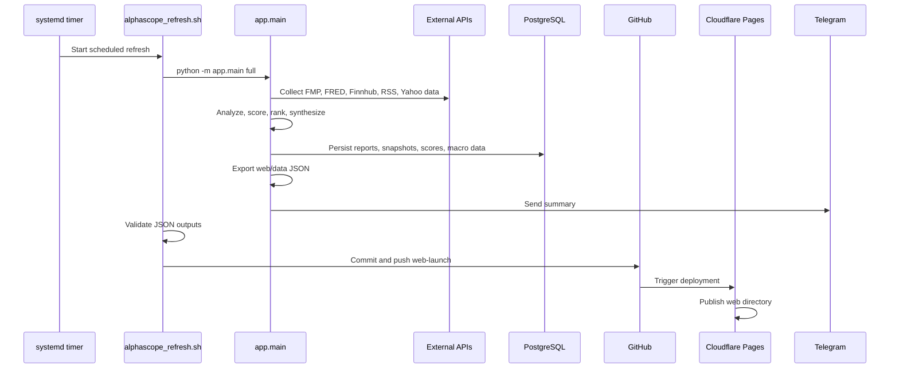

# AlphaScope Architecture

Date: 2026-06-02

## System Overview

AlphaScope Investor Edition V1 is a production-operational investor
intelligence platform. It runs as a Python pipeline on `automation-01`, stores
results in PostgreSQL on `db-01`, publishes static dashboard artifacts through
GitHub and Cloudflare Pages, and sends Telegram summaries after successful runs.

The system is intentionally split into deterministic analysis and AI-assisted
synthesis. Deterministic collectors, analytics, persistence, and ranking logic
produce repeatable scores. Gemini is used for market and event interpretation,
not as the primary source of the investor score.



## Component Responsibilities

### Collectors

Collectors live under `app/collectors/` and fetch external data.

- FMP quote, profile, and fundamentals collectors provide live quote,
  company-profile, and fundamental data.
- FRED macro collector stores macroeconomic observations and supports macro
  regime snapshots.
- Finnhub and RSS news collectors provide market event context.
- Yahoo-backed collectors provide macro market context, sector breadth,
  earnings context, and technical report inputs.

Collector output is normalized into dictionaries consumed by analytics,
persistence, report generation, and AI synthesis.

### Analytics

Analytics live under `app/analytics/` and `app/processors/`.

- `technical_engine.py` provides technical indicators from persisted market
  price history.
- `macro_regime_engine.py` converts FRED payloads into a macro snapshot.
- `investor_ranking.py` builds ranked investor opportunities.
- `investor_scoring_engine.py` calculates deterministic score components and a
  composite buy score.
- `confidence_engine.py` arbitrates market AI and event AI confidence into a
  unified market regime.
- News processors classify and combine raw event inputs.

### Investor Scoring

Investor scoring combines fundamental, dividend, technical, and price-position
signals into a composite buy score.



Current score weights:

- Valuation: 25%
- Financial quality: 30%
- Dividend: 15%
- Price position: 15%
- Technical: 15%

Recommendation thresholds:

- `Strong Buy`: buy score >= 80
- `Buy`: buy score >= 65
- `Watch`: buy score >= 50
- `Avoid`: buy score < 50

### Persistence

Persistence lives under `app/db/`.

The active pipeline writes:

- intelligence reports
- technical snapshots
- fundamental snapshots
- investor scores
- FRED observations
- macro snapshots
- event snapshots
- market snapshots when FMP quotes are available

Persistence is part of the production run, not a separate batch process.

### Dashboard Generation

Dashboard generation lives in `app/renderers/web_export.py`.

Generated files include:

- `web/data/latest-report.json`
- `web/data/full-report.json`
- `web/data/investor-rankings.json`
- `web/data/data-health.json`

The static dashboard under `web/` consumes these JSON artifacts. The production
deployment publishes the `web` directory through Cloudflare Pages.

### Telegram Delivery

Telegram delivery lives in `app/renderers/telegram.py`.

After a successful full run, AlphaScope sends a concise daily brief containing:

- final market regime
- quick take
- macro snapshot
- event risk
- technical signals
- recommended posture
- top investor opportunities

### Deployment Automation

Deployment automation is handled by `scripts/alphascope_refresh.sh` and the
systemd units under `deploy/systemd/`.

The deployment script:

1. Verifies repository context.
2. Runs `python -m app.main full`.
3. Validates generated JSON.
4. Prepares the `web-launch` worktree.
5. Copies generated web data into the deployment branch.
6. Commits changed data.
7. Pushes `origin web-launch`.

Cloudflare Pages then deploys the static site from GitHub.

## Database Architecture

AlphaScope uses PostgreSQL as the durable system of record.

Important tables include:

| Table | Purpose |
|---|---|
| `intelligence_reports` | AI market intelligence summaries |
| `technical_snapshots` | per-symbol technical signal history |
| `event_snapshots` | event and news intelligence snapshots |
| `fundamental_snapshots` | FMP company fundamentals by symbol/date |
| `investor_scores` | buy score, component scores, recommendation history |
| `fred_observations` | normalized FRED series observations |
| `macro_snapshots` | derived macro regime snapshots |
| `market_prices` | historical market price data used by technical analytics |
| `company_profiles` | company profile reference data |



## Deployment Architecture

The production deployment path is:

```text
automation-01
  -> GitHub repository branch web-launch
  -> Cloudflare Pages
  -> Production dashboard
```



## Data Flow

Complete production lifecycle:



## Runtime Sequence



