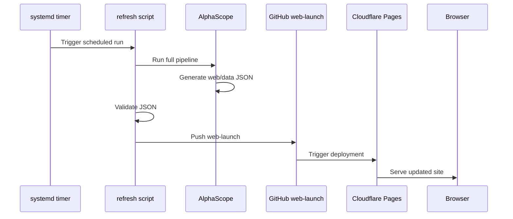

# AlphaScope Operations Runbook

Date: 2026-06-02

## Daily Operation

AlphaScope Investor Edition V1 runs unattended from `automation-01`.

The expected daily path is:

1. systemd timer starts `alphascope.service`.
2. `scripts/alphascope_refresh.sh` runs the full AlphaScope pipeline.
3. The pipeline collects market, macro, news, technical, and fundamental data.
4. PostgreSQL receives reports, snapshots, FRED observations, macro snapshots,
   fundamentals, and investor scores.
5. Web dashboard JSON files are generated under `web/data/`.
6. Telegram summary is sent.
7. Generated JSON files are validated.
8. Changed web data is committed and pushed to `origin/web-launch`.
9. Cloudflare Pages deploys the updated dashboard.

## Scheduled Runs

The timer is defined in `deploy/systemd/alphascope.timer`.

Schedule:

```text
09:00 UTC
13:00 UTC
17:00 UTC
```

Validation:

```bash
systemctl status alphascope.timer
systemctl list-timers --all | grep alphascope
systemctl status alphascope.service
```

## Deployment Process

Production deployment is Git-driven.



Expected deployment settings:

```text
Repository: dunga101/alphascope
Production branch: web-launch
Static output directory: web
```

## Validation Commands

### Check Service And Logs

```bash
systemctl status alphascope.timer
systemctl status alphascope.service
journalctl -u alphascope.service -n 200 --no-pager
tail -n 200 /home/dmudalige/projects/alphascope/logs/alphascope_refresh.log
```

### Run Manual Refresh

```bash
cd /home/dmudalige/projects/alphascope
./scripts/alphascope_refresh.sh
```

### Validate Generated JSON

```bash
cd /home/dmudalige/projects/alphascope
python3 -m json.tool web/data/latest-report.json >/dev/null
python3 -m json.tool web/data/full-report.json >/dev/null
python3 -m json.tool web/data/investor-rankings.json >/dev/null
python3 -m json.tool web/data/data-health.json >/dev/null
```

### Validate Git Deployment Branch

```bash
cd /home/dmudalige/projects/alphascope
git log origin/web-launch --oneline -5
git ls-remote --heads origin web-launch
git -C .deploy/web-launch status --short --branch
```

### Validate Cloudflare Site Data

Open the production dashboard and then directly inspect:

```text
https://<production-domain>/data/latest-report.json
https://<production-domain>/data/investor-rankings.json
https://<production-domain>/data/data-health.json
```

The timestamps should match the latest successful automation run.

## Troubleshooting

### GitHub Deploy Key Issue

Symptoms:

- systemd service reaches Git push step and fails.
- Logs show `Permission denied (publickey)`.
- Manual `git push origin web-launch` prompts or fails.

Validation:

```bash
cd /home/dmudalige/projects/alphascope
git remote -v
ssh -T git@github.com
git push origin web-launch
```

Expected remote:

```text
git@github.com:dunga101/alphascope.git
```

Recovery:

1. Confirm the automation user has the expected public key.
2. Add the public key to GitHub as a write-enabled deploy key or to a GitHub
   user with repository write access.
3. Re-run `ssh -T git@github.com`.
4. Re-run `git push origin web-launch`.
5. Restart or manually trigger `alphascope.service`.

Never store private SSH keys or GitHub tokens in the repository or `.env`.

### Cloudflare Deployment Validation

Symptoms:

- `origin/web-launch` receives new commits.
- Production website does not update.

Validation in Cloudflare dashboard:

1. Open Workers & Pages.
2. Select the AlphaScope Pages project.
3. Confirm repository is `dunga101/alphascope`.
4. Confirm production branch is `web-launch`.
5. Confirm build output directory is `web`.
6. Open Deployments and confirm the latest commit SHA exists.
7. Open the unique deployment URL and check `/data/latest-report.json`.
8. Compare the deployment URL with the custom domain.

Root causes to check:

- Pages project connected to the wrong repository.
- Production branch set to `main` instead of `web-launch`.
- Output directory not set to `web`.
- Automatic deployments disabled.
- Custom domain attached to another Pages project.

### Browser Cache Issue

Symptoms:

- Cloudflare deployment is successful.
- Direct JSON endpoints show current timestamps.
- Browser still displays old dashboard data.

Validation:

```text
Open /data/latest-report.json directly.
Compare generated_at with dashboard display.
Hard refresh browser.
Clear browser cache for the production domain.
Test in private/incognito browser session.
```

Recovery:

1. Hard-refresh the dashboard.
2. Clear browser cache for the site.
3. Confirm direct JSON endpoint freshness.
4. If the JSON endpoint is fresh but UI is stale, inspect browser cache and
   local storage before changing infrastructure.

### No New Git Commit

Symptoms:

- Run succeeds.
- No new commit appears on `web-launch`.

Likely cause:

- Generated `web/data` files matched the current `web-launch` versions.

Validation:

```bash
cd /home/dmudalige/projects/alphascope/.deploy/web-launch
git status --short
git log --oneline -5
```

### Invalid JSON

Symptoms:

- Script fails during validation.
- Cloudflare deployment is not triggered.

Validation:

```bash
python3 -m json.tool /home/dmudalige/projects/alphascope/web/data/latest-report.json >/dev/null
python3 -m json.tool /home/dmudalige/projects/alphascope/web/data/full-report.json >/dev/null
python3 -m json.tool /home/dmudalige/projects/alphascope/web/data/investor-rankings.json >/dev/null
python3 -m json.tool /home/dmudalige/projects/alphascope/web/data/data-health.json >/dev/null
```

Recovery:

1. Inspect the failed JSON file.
2. Check `journalctl` and `logs/alphascope_refresh.log`.
3. Re-run the pipeline after resolving the upstream data or export issue.

## Recovery Procedures

### Manual Production Refresh

```bash
cd /home/dmudalige/projects/alphascope
./scripts/alphascope_refresh.sh
```

### Restart Timer

```bash
sudo systemctl daemon-reload
sudo systemctl restart alphascope.timer
systemctl status alphascope.timer
```

### Disable Automation Temporarily

```bash
sudo systemctl disable --now alphascope.timer
```

### Re-enable Automation

```bash
sudo systemctl enable --now alphascope.timer
```

### Roll Back A Bad Generated-Data Deployment

```bash
cd /home/dmudalige/projects/alphascope/.deploy/web-launch
git revert <bad-refresh-commit-sha>
git push origin web-launch
```

## Operational Checklist

- Confirm latest systemd run completed successfully.
- Confirm Telegram summary was delivered.
- Confirm `origin/web-launch` received the latest generated-data commit.
- Confirm Cloudflare deployment succeeded for that commit.
- Confirm `/data/latest-report.json` timestamp is current.
- Confirm dashboard displays current rankings.

